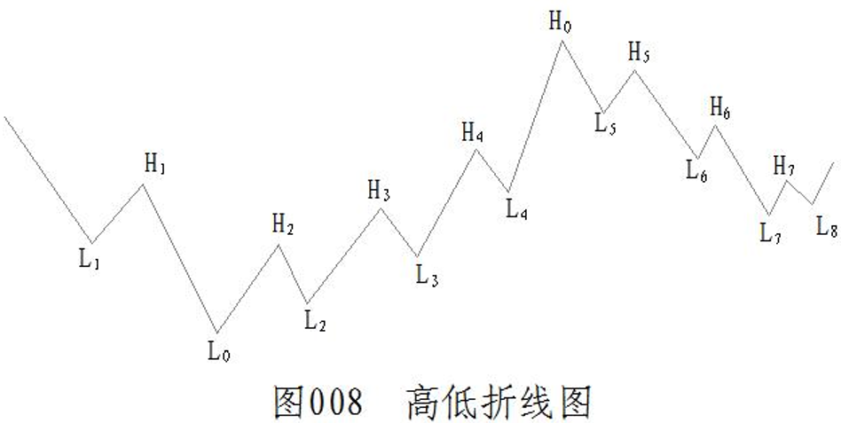

# 图 008 与二十项定义组合

图像来源为用户提供的 `Snipaste_2026-10-10_00-59-47.png`。原条目 19 包含轧空低与杀多高两个概念，因此十九条对应二十个基础概念。通用公式和单独入口见 [折线趋势定义基座](trend_primitives_contract.md)。

图片只给出折线顺序和相对位置，没有日期轴、价格轴、K 棒和 abc 内部转折。示例及回归使用明确给出的示意价格和确认日期；这些数值不是从图片提取的真实行情。

`Lx/Hx` 是讲解用的逻辑标签，不是算法身份或固定模板。实际行情的转折数量、点间时间、上涨／下跌幅度和子波数量都可变化。生产入口不接受这些标签，也不要求固定的十七个点；关键位取所选极点左侧最近反转，趋势检查窗口内实际存在的每组高低点，回档／反弹比例取实际攻击及其已确认回档。

## 按标签理解

从左至右：`L1,H1,L0,H2,L2,H3,L3,H4,L4,H0,L5,H5,L6,H6,L7,H7,L8`。

| 目标点 | 向左最近相反转折 | 含义               |
| ------ | ---------------- | ------------------ |
| L0     | H1               | 整图最低点的末跌高 |
| L7     | H6               | 选择 L7 时的末跌高 |
| H0     | L4               | 整图最高点的末升低 |
| H4     | L3               | 选择 H4 时的末升低 |

四个映射取最近的左侧转折，不取离得更远但价格更高／更低的点。选择目标极点与选择分析窗口是不同操作；窗口左边缺少前置点时返回未知，不补造锚点。

| 分段或事件 | 定义证据                                               |
| ---------- | ------------------------------------------------------ |
| L0→H0      | H2<H3<H4<H0 且 L0<L2<L3<L4，多头趋势                   |
| H4 超过 H1 | 突破冻结末跌高，翻空为多                               |
| H4→L4      | L4 已确认，且 (H4-L4)/(H4-L3)<0.67，空多交替           |
| H5 已确认  | 拉回未破 L4，反弹不过 H0 后再次向下，头部疑虑          |
| L7 低于 L4 | 严格跌破末升低，翻多为空；已有疑虑则头部成形           |
| L7→H7      | H7 已确认，且 (H7-L7)/(H6-L7)<0.67，多空交替           |
| H0→L7      | 已确认高点、低点分别递减，空头趋势                     |
| L8 已确认  | 回档不再创新低，并再次向上，底部疑虑；未越 H6 不称成形 |

整张图经历下降、上涨、下降和局部反弹，应通过窗口分别观察。扩大到 L8 后，低点 L8 高于 L7，整个后段不再满足“每一个低点都下降”。局部正反转也不单独证明整个趋势已经翻多。

## 统一代码入口

`wavequant.domain.market_structure.trend_foundations.observe_trend_foundations` 接收 K 棒、已确认折线点、股票、周期和观察窗口，组合已有四层逻辑：

1. `candle_primitives`：六项相邻 K 棒关系与虚高／虚低。
2. `trend_primitives` / `observe_structure`：反转点、窗口极值关键位和全窗口趋势。
3. 可选冻结 `transition_context`：翻向、交替、疑虑和成形的因果证据。
4. 可选 `n_setup`：已完成正 N 的轧空低或倒 N 的杀多高。

默认 `attack_basis=AttackBasis.INTRABAR`，与图中的 `H4>H1` / `L7<L4` 对应；需要收盘越线时显式传入 `AttackBasis.CLOSE`。没有冻结上下文时，`transition` / `signals` 保留 `None`，不会仅凭目前的局部反转猜此前多空背景。没有 N 结构时也不把普通 K 棒的虚低／虚高冒充轧空低／杀多高。

左侧背景截至 L0 只有一个已确认负反转，不能据图外未命名折线猜出完整空头序列。示例在 H2 已确认后冻结已知空头背景，再观察后续 H4 突破；不会把未来 H4 的证据倒填到 L0。

可执行示例 `examples/figure008_foundations.py` 仅在说明层为样本点配图中标签，输出关键位、分段趋势和信号。回归额外改变时间跨度、价格尺度和转折数量来验证通用性。`asof_index` 同时限制行情前缀和确认日期；提前绘在左侧但尚未确认的点仍不能使用。

## 比例、abc 与 N 的边界

回档 `<0.67` 与弱回档 `<0.33` 独立计算。没有实际数值时，图形看起来接近三分之一不能证明严格小于 33%；相等也不满足。图片没有画出 H4→L4 或 L7→H7 的内部 abc，三波及等浪由已有 `observe_abc` 独立校验，不自动增加为所有交替的必需条件。

N 攻击棒的虚低仍为 `min(今低,昨收)`，虚高仍为 `max(今高,昨收)`。图 008 本身没有攻击 K 棒，不能据示意折线推断真实轧空低、杀多高、量增或参与者意图；组合入口需要调用方另外提供合法的 `NSetup`。
